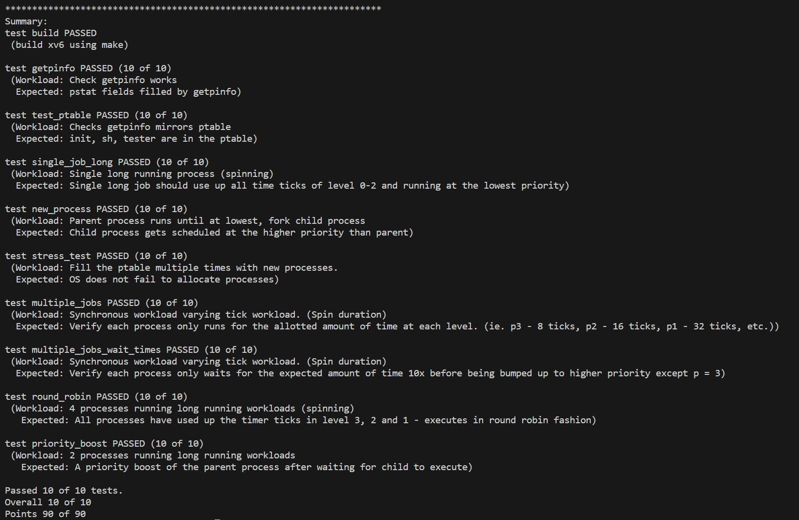

[](https://classroom.github.com/a/E4q2diRZ)
# xv6 Scheduler



### Implement MLFQ

1. **定义说明**

+ `/include/param.h` 中定义了 **四个优先级，编号从 3（最高）到 0（最低）**

    ```C
    #define PRIORITY_HIGH   3
    #define PRIORITY_MEDIUM 2
    #define PRIORITY_LOW    1
    #define PRIORITY_BOTTOM 0
    ```

+ `/include/param.h` 中定义了 不同优先级的 `timer ticks`

    > 优先级 3 的时间片是 8 个计时器滴答；2是 16 个； 1是 32 个； 0执行该过程直到完成。
    >
    > 在0级时，由于wait_time>500时，升级，因此将TIME_SLICE_0设置为50

    ```C
    #define TIME_SLICE_3 8
    #define TIME_SLICE_2 16
    #define TIME_SLICE_1 32
    #define TIME_SLICE_0 50
    ```

+ 在`/kernel/proc.h` 中修改了 `PCB` 数据结构

    ```C
    struct proc {

    //...  
      int priority;                // current priority level
      int ticks[4];                // RUNNING/SCHEDULED at each priority queue 
      int wait_ticks[4];           // process has waited before being scheduled
    };
    ```

+ 在`/kernel/proc.c` 中 创建了 `不同优先级的时间片表` & `四个优先级队列` & `各个优先级队列长度表`

	> 由于分散的队列管理不便，因此创建结构体pqueue，将队列与队列长度结合。

    ```C
    int time_slice[4]={TIME_SLICE_0,TIME_SLICE_1,TIME_SLICE_2,TIME_SLICE_3};
  
    //priority queue
    struct pqueue{
      int len;
      struct proc* qproc[NPROC];
    };
    struct pqueue* pque[4] = {
      &(struct pqueue){ .len = 0, .qproc = { NULL } },
      &(struct pqueue){ .len = 0, .qproc = { NULL } },
      &(struct pqueue){ .len = 0, .qproc = { NULL } },
      &(struct pqueue){ .len = 0, .qproc = { NULL } }
    };
    ```

2. `static struct proc* allocproc(void)`

+ 分配时初始化进程

  ```C
  /* alloc to the queue */
    p->priority = PRIORITY_HIGH;
    for(int i=0;i<=PRIORITY_HIGH;i++){
      p->ticks[i] = 0;
      p->wait_ticks[i]=0;
    }
    int len = pque[PRIORITY_HIGH]->len;
    pque[PRIORITY_HIGH]->qproc[len] = p;
    pque[PRIORITY_HIGH]->len++;
  ```


3. `void scheduler(void);`

+ 优先级为3、2、1的进程队列使用循环方式调度该优先级上的所有进程，当进程消耗完时间片后，应降低一个优先级

  ```C
      //a process queue with a priority of 3,2,1 uses a round-robin to schedule all processes at that priority
      for (int lev = PRIORITY_HIGH; lev >0; lev--){
        if (pque[lev]->len > 0)
        {
          /* j = p index of the queue */
          for (int j = 0; j < pque[lev]->len; j++)
          {
            if (pque[lev]->qproc[j]->state != RUNNABLE)
              continue;
            p = pque[lev]->qproc[j];
            p->wait_ticks[p->priority] = 0;
            if(p->ticks[lev]>=time_slice[lev]){
              p->ticks[lev]=0;
            }
            while(p->ticks[lev]<time_slice[lev]&&p->state==RUNNABLE){
              p->ticks[lev]++;
              proc=p;
              switchuvm(p);
              p->state = RUNNING;
              priorityboost();
              swtch(&cpu->scheduler, proc->context);
              switchkvm();
              proc=0;
            }
            downgrade(p,j);
          }
        }
      }
  ```

+ 优先级为0的进程采用先进先出的方式进行调度，且调度的进程应一直执行直到完毕

  ```c
      //priority 0 processes are scheduled on a FIFO
      //the scheduled process should continue to exec until it finished or exit
      for(int j=0;j<pque[0]->len;j++){
        if (pque[0]->qproc[j]->state != RUNNABLE)
          continue;
        p = pque[0]->qproc[j];
        p->wait_ticks[p->priority] = 0;
        while(p->state==RUNNABLE){
          p->ticks[p->priority]++;
          proc=p;
          switchuvm(p);
          p->state = RUNNING;
          priorityboost();
          swtch(&cpu->scheduler, proc->context);
          switchkvm();
          proc=0;
        }
      }
  ```

+ 检查当前进程所用时间片，判断是否需要 **downgraded**。当一个进程用完了它的时间片，就应该降级到下一个较低的优先级。

  将`downgrade`过程分离为一个函数

  ```C
  //when a process runs out of its time slice, it should be downgraded to the lower priority
  //p is the process to be downgraded
  //idx is the index of p's position in its priority queue
  void
  downgrade(struct proc* p,int idx){
    int lev=p->priority;
    if (lev != PRIORITY_BOTTOM)
    {
      if (p->ticks[lev] >= time_slice[lev])
      {
        /* downgrade*/
        p->priority--;
        pque[lev - 1]->qproc[pque[lev - 1]->len] = p;
        pque[lev - 1]->len++;
        for (int k = idx; k < pque[lev]->len - 1; k++)
          pque[lev]->qproc[k] = pque[lev]->qproc[k + 1];
        pque[lev]->qproc[pque[lev]->len] = NULL;
        pque[lev]->len--;
      }
    }
  }
  ```

+ 当选择好下一个时钟滴答调度的进程`p`，并将`p`的状态设置为`RUNNING`后，检查`ptable`中的所有就绪进程（`RUNNABLE`），并根据等待时间判断是否需要**upgraded**

  ```C
  //If a process has waited 10x the time slice in its current priority level, it is raised to the next higher priority level at this time
  void
  priorityboost(){
    struct proc *starvp;
    for (starvp = ptable.proc; starvp < &ptable.proc[NPROC]; starvp++){//Iterate through all processes in ptable
      if (starvp->state != RUNNABLE)
        continue;
      int lev=starvp->priority;
      starvp->wait_ticks[lev]++;
  
      /* check starv */
      if (starvp->wait_ticks[starvp->priority] >= (time_slice[starvp->priority] * 10)){
        starvp->wait_ticks[starvp->priority] = 0;
        if (starvp->priority != 3){
          /* start upgrade p */
          int lev = starvp->priority;
          int idx=0;
          while(pque[lev]->qproc[idx]!=starvp)idx++;
          for (int k = idx; k < pque[lev]->len - 1; k++)
            pque[lev]->qproc[k] = pque[lev]->qproc[k + 1];
          pque[lev]->qproc[pque[lev]->len] = NULL;
          pque[lev]->len--;
  
          starvp->priority++;
          pque[lev + 1]->qproc[pque[lev + 1]->len] = starvp;
          pque[lev + 1]->len++;
          /* end upgrade p */
        }
      }
    }
  }
  ```

+ 上下文切换

  ```C
    p->wait_ticks[p->priority] = 0;
    proc = p;
    switchuvm(p);
    p->state = RUNNING;
    swtch(&cpu->scheduler, proc->context);
    switchkvm();
  ```


### Create new system calls

1. 对`getpinfo`函数进行声明，分别在：

   `xv6/include/sysfunc.h`

   `xv6/include/sysycall.h`

   `xv6/include/sysycall.c`

   `xv6/include/sysproc.c`

   `xv6/user/user.h`

   xv6/user/usys.h

2. `xv6/include/sysproc.c`：

   ```
   int
   sys_getpinfo(void)
   ```

3. `xv6/include/proc.c`：

   ```
   int
   getpinfo(struct pstat* p)
   ```

   （关于`pstat`和`proc`结构体说明分别在`xv6/include/pstat.h`和`xv6/include/proc.h`)

### 问题

1. ```shell
   unexpected trap 14 from cpu 0 eip 103f3f (cr2=0x0)
   cpu0: panic: trap
    106841 1064df 104003 103222 103195 0 0 0 0 0
   ```

   猜测：对于队列链表的管理出现了问题，出现越界等情况。

   验证：结构体数组初始化的问题。

   在初始化后问题解决。


